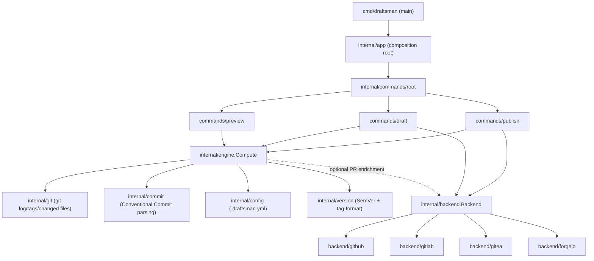

# Architecture

draftsman is a small layered CLI: a thin command layer parses flags and delegates to one core `engine.Compute` call, which builds a `Plan` from the local git repository and an optional `Backend`. Commands then either print the `Plan` (`preview`) or hand it to the `Backend` (`draft`, `publish`).

## Layers

**`cmd/draftsman`** — the binary entrypoint. Holds the `Version`/`Commit`/`BuildDate` package-level `var`s that `-ldflags -X` injects at build time (see the [`Dockerfile`](https://github.com/brpaz/draftsman/blob/main/Dockerfile), [`.goreleaser.yaml`](https://github.com/brpaz/draftsman/blob/main/.goreleaser.yaml), and [`flake.nix`](https://github.com/brpaz/draftsman/blob/main/flake.nix) for the three places that set them), then hands off to `internal/app`.

**`internal/app`** — the composition root. Wires the root command with its three subcommands and the version metadata; owns nothing else.

**`internal/commands/{root,preview,draft,publish,shared}`** — the CLI layer, built on [urfave/cli v3](https://cli.urfave.org/). `shared` holds flag definitions and `ResolveBackend`, the one place that turns `--backend`/`--token`/`--repo`/`--base-url` into a concrete `Backend` (or `nil`, for `preview` when those flags are omitted). Each command is otherwise a thin `Action` function: load config, resolve backend, call `engine.Compute`, then either render or dispatch to the backend.

**`internal/engine`** — the core. `Compute` orchestrates everything below it into a `Plan`: reads commits via `internal/git`, parses each via `internal/commit`, resolves Package membership and category/section mapping from `internal/config`, computes the SemVer bump and tag range via `internal/version`, and — when a `Backend` was supplied — attempts PR-reference enrichment (text extraction first, live API fallback on GitHub and GitLab; see [ADR-0001](../adr/0001-pr-linkage-strategy.md)). `single` vs `multi` mode ([ADR-0004](../adr/0004-single-vs-multi-release-mode.md)) branches inside `Compute` into `computeSingle`/`computeMulti`, producing either one repo-wide `Plan` or one `PackagePlan` per Package.

**`internal/git`, `internal/commit`, `internal/config`, `internal/version`** — dependency-free building blocks `engine` composes. `git` shells out to the local `git` binary (log, changed files, tags) with no assumptions beyond it being on `PATH`. `commit` parses a raw commit message into a Conventional Commit (type, scope, breaking flag, subject, footers) with no knowledge of git or backends. `config` loads and defaults `.draftsman.yml`. `version` parses/bumps SemVer and matches tags against `tag-format`.

**`internal/backend`** — defines the `Backend` interface (`UpsertDraft`, `Publish`, `ResolvePR`, `CommitURL`, `CompareURL`, `ResolveAuthor`) that `internal/backend/{github,gitlab,gitea,forgejo}` each implement independently against their respective REST APIs. `draft`/`publish` depend only on this interface, never on a concrete adapter — see [ADR-0002](../adr/0002-continuous-draft-model.md) for why the workflow is "always-current draft, human/CI publishes" rather than stateless one-shot generation, and [ADR-0003](../adr/0003-commit-based-entries.md) for why entries are derived from commits rather than PR metadata.

## Why this shape

The `Backend` interface is the seam that makes four git hosting platforms cost one implementation each rather than four parallel command implementations — `internal/commands` and `internal/engine` are entirely backend-agnostic. Conversely, `internal/git`/`internal/commit`/`internal/version` have zero knowledge of backends or CLI concerns, which is what makes them straightforward to test against real temporary git repos and real commit-message fixtures rather than mocks (see [`internal/engine/engine_test.go`](https://github.com/brpaz/draftsman/blob/main/internal/engine/engine_test.go)).
